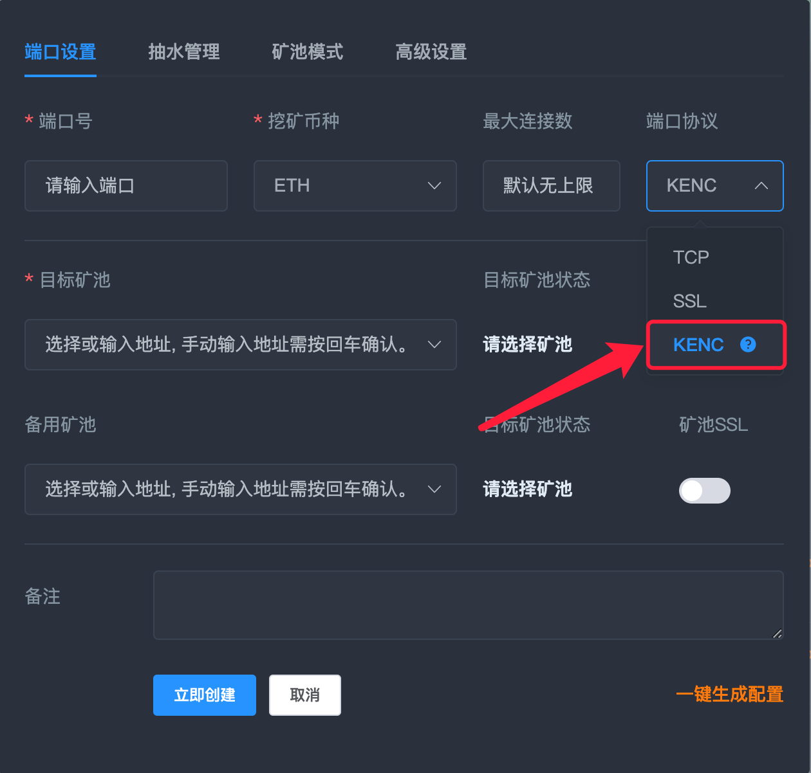
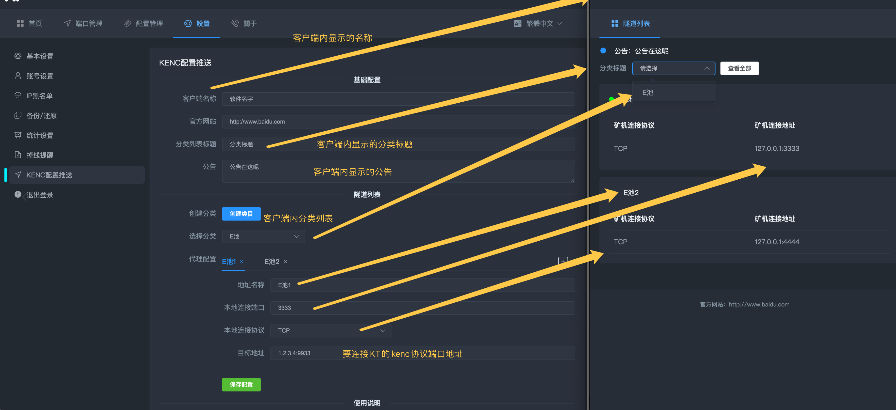

<div align="center">

# KENC文档说明

</div>

<p id="kenc"></p>

### KENC是本地->远程LX隧道，局域网部署在一台设备上即可，可与远程LXMinerProxy通过KENC协议进行通信。

<a href="https://github.com/tiancao2022/LXMinerProxy/raw/master/KENC/windows.zip">点击下载WINDOWS客户端</a>

<a href="https://github.com/tiancao2022/LXMinerProxy/raw/master/KENC/kenc_vcu-firs-1.0.linux">点击下载LINUX客户端</a>

### KENC LINUX系统下安装脚本
```
root用户直接执行以下命令, 根据提示选择对应功能即可。
bash <(curl -s -L https://raw.githubusercontent.com/tiancao2022/LXMinerProxy/master/kenc.sh)
默认端口为3101
```
###WIN系统下载
```
WIN系统请直接下载kenc_v_windows 主程序kenc-electron.exe .zip安装包
win系统版本kenc 主程序为“kenc-electron.exe”
```
### 使用环境
```
LXMinerproxy版本>=2.1.0
```

## 使用说明

### 1.远程lxminerproxy先配置一个KENC协议的端口



### 2.在LX的设置页面找到KENC配置推送, 如下图


### 3. KENC客户端首次打开, 或点击右上角设置, 即可更改配置推送地址, 配置设置完毕后重启KENC客户端即可拉取最新配置。
